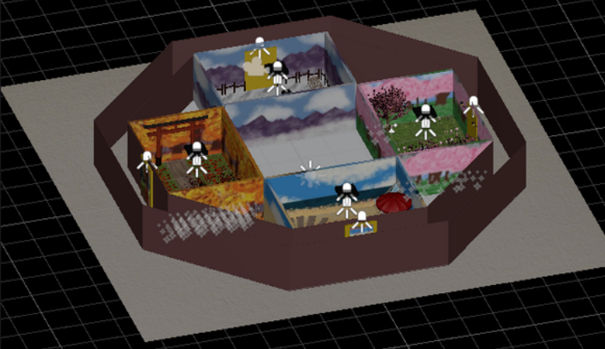

# Octangle

    A Redirected Walking Experience.

# Table of Contents

- [Octangle](#octangle)
- [Table of Contents](#table-of-contents)
- [Repository](#repository)
- [Development Information](#development-information)
- [About](#about)
  - [Goal](#goal)
  - [Infographic](#infographic)

# Repository

This is a placeholder repository of sorts since GitHub does not currently support pinning repositories made by other users (even if it is a shared repo in an Organization).

The repository containing the files can be found at the linked [Octangle GitHub Repository](https://github.com/HCI-Capstone/octangle-supported).

# Development Information

This experience was developed for our Senior Human-Computer Interaction Capstone in the Unity Game Engine (v. 2020.3.37f1) using the Oculus Quest 2 by:

  - Macey Cohn
  - Emaan Rana
  - Delaney Reed

Under the direction and guidance of:

  - [Jerald Thomas](https://www.jeraldthomas.com/)
  - [Doug Bowman](https://wordpress.cs.vt.edu/3digroup/author/dbowman/)

# About

    

## Goal

The goal of the experience is to demonstrate how manipulating the one to one mapping of real life movements to virtual reality movements can assist in a more accessible experience for users restricted to utilizing smaller spaces for virtual reality experiences. The Octangle in particular utilizes both Translation Gain where virtual speed is faster than real life speed as well as Rotation Attenuation where virtual rotation is shorter than the actual real world rotation made by the user.

## Infographic

For more information on the Octangle, check out this great [Infographic](https://github.com/HCI-Capstone/octangle-supported/tree/main/Files/Infographic.pdf) Delaney made.